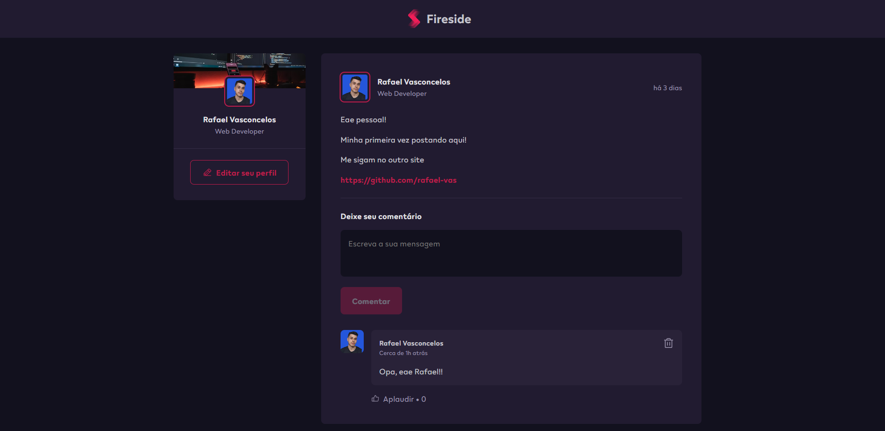

# Fireside - Plataforma Interativa

Bem-vindo ao Fireside, uma plataforma para desenvolvedores compartilharem seus pensamentos, ideias e colaborarem por meio de postagens interativas e comentários.



## Sobre o Projeto

O Fireside é um espaço virtual dedicado à comunidade de desenvolvedores. Aqui, você pode compartilhar suas últimas conquistas, aprender com as experiências de outros desenvolvedores e se envolver em conversas estimulantes. Seja para discutir tópicos relacionados ao desenvolvimento, compartilhar artigos interessantes ou receber feedback sobre projetos pessoais, o Fireside é o lugar perfeito para se conectar com outros membros da comunidade.

## Acesse o Projeto
```
https://fireside-hub.netlify.app/
```

## Recursos

- Os usuários podem comentar em posts para iniciar discussões e trocar ideias.
- Cada comentário inclui informações do autor, como avatar, nome e cargo.
- Os comentários podem conter texto e links para recursos adicionais.
- Os usuários podem expressar seu apreço por um post ou um comentário dando um "like".
- Os autores dos comentários têm a capacidade de excluir seus próprios comentários.

Lembre-se de que o Fireside é uma aplicação de compartilhamento de mensagens temporário, e os dados, incluindo comentários e curtidas, não são armazenados permanentemente. Ao recarregar a página, as interações anteriores podem ser perdidas.

## Tecnologias Utilizadas

- [Vite](https://vitejs.dev/): Uma estrutura de compilação ultrarrápida para desenvolvimento web.
- [React](https://reactjs.org/): Biblioteca JavaScript para construir interfaces de usuário.
- [Date-fns](https://date-fns.org/): Biblioteca JavaScript para formatação de datas.
- [Phosphor React](https://phosphoricons.com/): Ícones SVG personalizáveis para sua interface.
